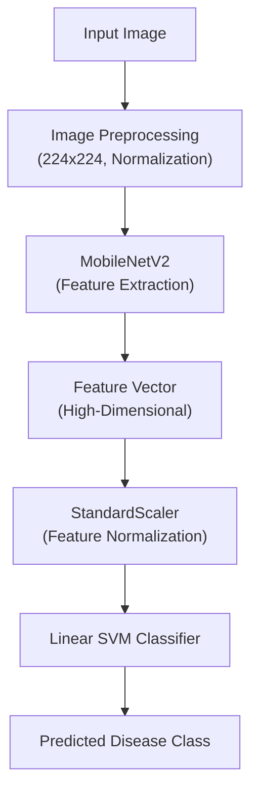
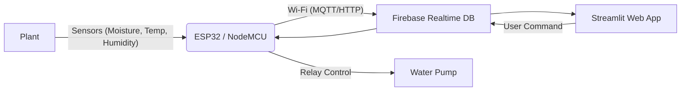

# Smart Plant Care System (Agro Guard)

An AI and IoT-based system to detect plant diseases and automate watering, utilizing a hybrid Deep Learning and Machine Learning approach.

## 🧠 Hybrid Model Architecture

A Convolutional Neural Network (**MobileNetV2**) is used to extract high-level features from plant leaf images, and a **Linear Support Vector Machine (SVM)** is used for final classification.

### Pipeline Flow


## 📊 Results
- **Validation Accuracy**: 95.85% (Hybrid CNN + SVM)
- Strong precision and recall across most classes.
- Realistic performance with strictly separated training and validation sets to prevent data leakage.

## 📂 Dataset
- **Dataset Name**: New Plant Diseases Dataset (Augmented)
- **Source**: Kaggle
- **Total Classes**: 38
- **Images per Class**: ~400–500
- **Split**: Train / Validation
- **Image Size**: 224 × 224

## 🛠️ Technologies Used
- **Language**: Python 3
- **Deep Learning**: TensorFlow / Keras
- **Machine Learning**: Scikit-learn, Joblib
- **Data Processing**: NumPy, Pandas
- **Web Framework**: Streamlit
- **Visualization**: Plotly Express
- **Development**: Google Colab (Training), VS Code (Local Inference)

## 🧪 Model Details

### 1. CNN (Feature Extractor)
- **Architecture**: MobileNetV2
- **Pretrained**: ImageNet
- **Configuration**: Final classification layer removed to output feature vectors.
- **Output**: High-dimensional feature embeddings.

### 2. Classifier
- **Model**: Linear Support Vector Machine (SVM)
- **Loss Function**: Hinge loss
- **Input**: CNN-extracted features (Normalized)

## 💧 Smart Watering System

The system integrates an IoT module to monitor plant health in real-time and automate irrigation.

### Architecture


### Features
- **Real-time Monitoring**:
  - **Soil Moisture**: Real-time reading from capacitive sensor (Pin 34).
  - **Environment**: Temperature and Humidity data (Currently simulated in firmware, supports DHT11/22).
- **Remote Control**: Manual pump activation via the Web Dashboard.
- **Automation**: Automatic watering when moisture drops below 50%.
- **Smart Logic**:
  - **Live Mode**: Syncs with Firebase to display real-time sensor data.
  - **Simulation Mode**: Web app fallback to demonstrate functionality when hardware is offline.

### Hardware Stack (Current Firmware)
- **Microcontroller**: ESP32
- **Sensors**: Capacitive Soil Moisture Sensor (Analog)
- **Actuators**: 5V Relay Module, Water Pump
- **Libraries**: `Firebase_ESP_Client`, `ArduinoJson`

### Data Flow
1. **ESP32** reads soil moisture analog value.
2. **ESP32** generates simulated temperature/humidity (placeholder for DHT sensor).
3. Data is pushed to **Firebase** (`/iot_dashboard/live_data`) every 10 seconds.
4. **Streamlit App** allows user to trigger "Activate Pump".
5. **ESP32** listens to `/iot_dashboard/controls/pump` and triggers the Relay.

## 🚀 How to Run

1. **Install Dependencies**:
   ```bash
   pip install -r requirements.txt
   ```

2. **Run the Application**:
   ```bash
   streamlit run improved_app.py
   # OR
   streamlit run webapp.py
   ```
