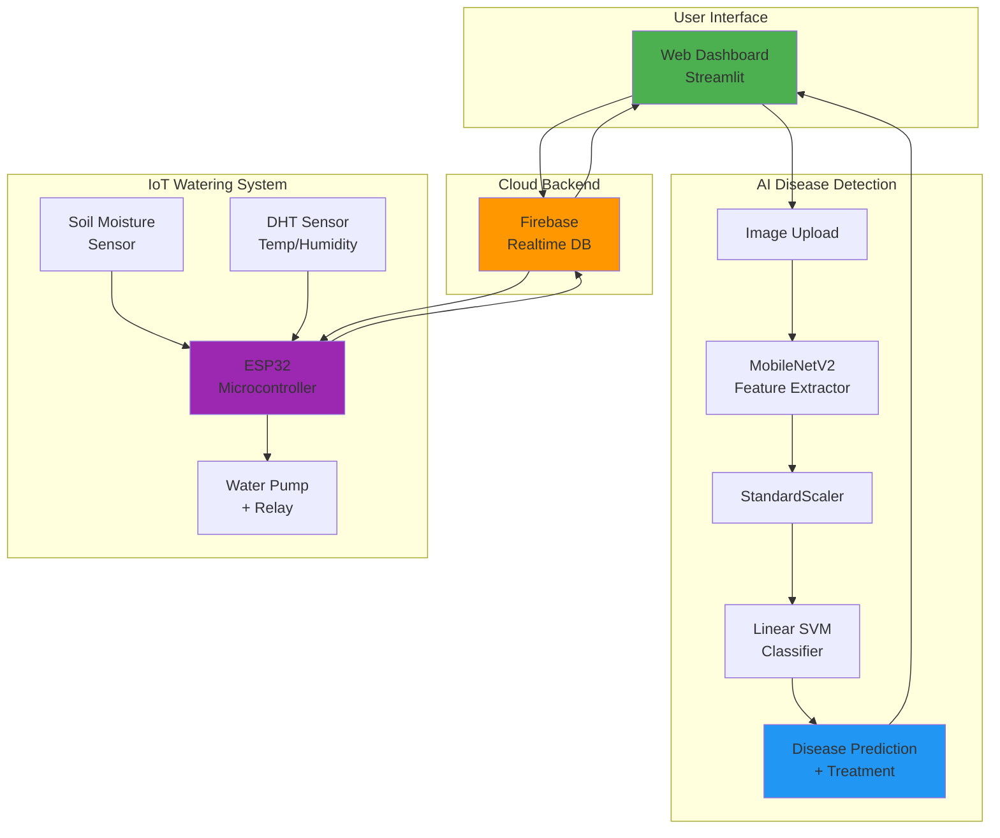
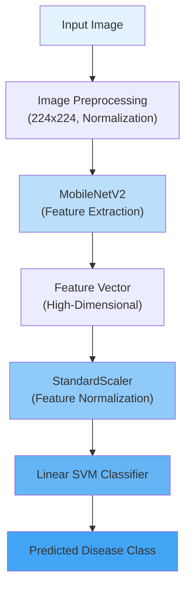
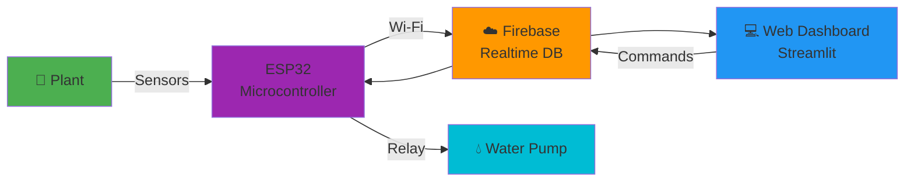
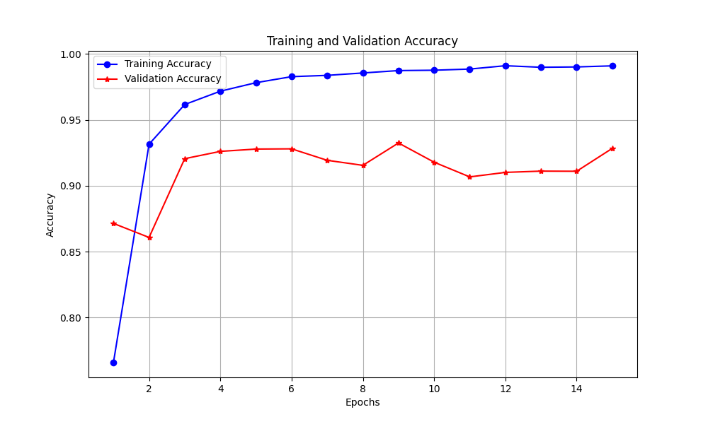
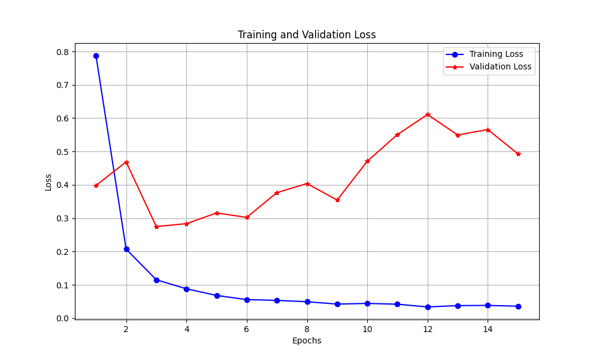

<div align="center">

# 🌱 Agro Guard: Smart Plant Care System

### *AI-Powered Plant Disease Detection & IoT-Based Automated Irrigation*

[](https://www.python.org/)
[](https://www.tensorflow.org/)
[](https://streamlit.io/)
[](LICENSE)

[🚀 Live Demo](#) • [📖 Documentation](#) • [🎯 Features](#-key-features) • [💻 Installation](#-installation)

---

</div>

## 📋 Table of Contents
- [Overview](#-overview)
- [Key Features](#-key-features)
- [System Architecture](#-system-architecture)
- [Hybrid AI Model](#-hybrid-ai-model)
- [Smart Watering System](#-smart-watering-system)
- [Results & Performance](#-results--performance)
- [Installation](#-installation)
- [Usage](#-usage)
- [Technologies](#-technologies)
- [Dataset](#-dataset)
- [Contributing](#-contributing)

---

## 🌟 Overview

**Agro Guard** is an end-to-end intelligent plant care solution that combines cutting-edge **Deep Learning**, **Machine Learning**, and **IoT** technologies to revolutionize agriculture and home gardening. The system provides:

- 🔬 **Instant Disease Detection**: Identify 38 different plant diseases with 95.85% accuracy
- 💧 **Smart Irrigation**: Automated watering based on real-time soil moisture monitoring
- 📊 **Live Monitoring**: Track temperature, humidity, and soil conditions remotely
- 🌐 **Web Dashboard**: Beautiful, responsive interface accessible from any device

> **Perfect for**: Farmers, gardeners, agricultural researchers, and smart home enthusiasts

---

## ✨ Key Features

<table>
<tr>
<td width="50%">

### 🤖 AI-Powered Diagnosis
- **38 Disease Classes** detection
- **Dual Input Modes**: Upload or live camera
- **95.85% Accuracy** with hybrid CNN+SVM
- **Instant Results** with confidence scores
- **Treatment Recommendations** for each disease
- **Top-5 Predictions** visualization

</td>
<td width="50%">

### 💧 IoT Smart Watering
- **Real-time Monitoring**: Soil moisture, temp, humidity
- **Automated Irrigation**: Triggers at <50% moisture
- **Remote Control**: Manual pump activation via web
- **Firebase Integration**: Cloud-based data sync
- **Live/Simulation Modes**: Works with or without hardware
- **Activity Logging**: Track all watering events

</td>
</tr>
</table>

---

## 🏗️ System Architecture

### Complete System Flow



---

## 🧠 Hybrid AI Model

### Architecture Overview

Our innovative **Hybrid CNN + SVM** approach combines the feature extraction power of deep learning with the classification precision of support vector machines.



### Model Components

#### 1️⃣ CNN Feature Extractor (MobileNetV2)
- **Architecture**: MobileNetV2 (Pretrained on ImageNet)
- **Purpose**: Extract high-level visual features from leaf images
- **Output**: Dense feature embeddings
- **Advantages**: 
  - Lightweight and efficient
  - Transfer learning from millions of images
  - Robust feature representation

#### 2️⃣ Feature Normalization (StandardScaler)
- **Purpose**: Normalize features for optimal SVM performance
- **Method**: Zero mean, unit variance scaling
- **Impact**: Improved model convergence and accuracy

#### 3️⃣ SVM Classifier (Linear SVM)
- **Type**: Linear Support Vector Machine
- **Loss Function**: Hinge loss
- **Purpose**: Final disease classification
- **Advantages**:
  - Excellent generalization
  - Robust to overfitting
  - Efficient inference

---

## 💧 Smart Watering System

### IoT Architecture



### Hardware Components

| Component | Model | Purpose |
|-----------|-------|---------|
| **Microcontroller** | ESP32 | Main processing unit with Wi-Fi |
| **Soil Sensor** | Capacitive Moisture Sensor | Real-time soil moisture (Pin 34) |
| **Environment** | DHT11/22 | Temperature & Humidity (Simulated in current firmware) |
| **Actuator** | 5V Relay Module | Controls water pump |
| **Pump** | Mini Water Pump | Delivers water to plants |

### Smart Features

- ⚡ **Auto-Watering**: Activates pump when moisture < 50%
- 📡 **Real-time Sync**: Data updates every 10 seconds
- 🎛️ **Manual Override**: Web-based pump control
- 📝 **Event Logging**: Tracks all watering activities
- 🔄 **Dual Mode**: Live (with hardware) or Simulation (demo)

---

## 📊 Results & Performance

### Model Metrics

<div align="center">

| Metric | Score |
|--------|-------|
| **Validation Accuracy** | **95.85%** |
| **Precision** | High across all classes |
| **Recall** | Strong detection rates |
| **F1-Score** | Balanced performance |

</div>

### Training Performance

<table>
<tr>
<td width="50%" align="center">

<br/><b>Training & Validation Accuracy</b>
</td>
<td width="50%" align="center">

<br/><b>Training & Validation Loss</b>
</td>
</tr>
</table>

### Key Achievements

✅ **No Data Leakage**: Strict train/validation separation  
✅ **Realistic Performance**: Tested on unseen validation data  
✅ **Production Ready**: Optimized for real-world deployment  
✅ **Fast Inference**: Real-time predictions (<1 second)  

---

## 🚀 Installation

### Prerequisites

- Python 3.9+
- pip package manager
- (Optional) ESP32 + sensors for IoT features

### Quick Start

1️⃣ **Clone the Repository**
```bash
git clone https://github.com/Sobhagyaverma/Smart-Plant-Care-System.git
cd Smart-Plant-Care-System
```

2️⃣ **Create Virtual Environment** (Recommended)
```bash
python -m venv venv
source venv/bin/activate  # On Windows: venv\Scripts\activate
```

3️⃣ **Install Dependencies**
```bash
pip install -r requirements.txt
```

4️⃣ **Run the Application**
```bash
streamlit run webapp.py
```

5️⃣ **Open in Browser**
```
Local URL: http://localhost:8501
```

### Firebase Setup (For IoT Features)

1. Create a Firebase project at [console.firebase.google.com](https://console.firebase.google.com)
2. Enable Realtime Database
3. Download `firebase-key.json` to project root
4. For cloud deployment, add credentials to Streamlit secrets

---

## 💻 Usage

### Disease Detection

1. Navigate to **🔍 Disease Detection** tab
2. Upload a plant leaf image or use camera
3. View instant diagnosis with confidence score
4. Get treatment recommendations and prevention tips
5. See top-5 alternative predictions

### Smart Watering

1. Navigate to **💧 Smart Watering** tab
2. Monitor real-time sensor data (moisture, temp, humidity)
3. View historical trends in interactive charts
4. Manually activate pump or rely on automation
5. Check activity logs for watering history

---

## 🛠️ Technologies

### AI/ML Stack
- **TensorFlow 2.19** - Deep learning framework
- **Keras 3.10** - High-level neural networks API
- **Scikit-learn 1.6** - Machine learning library
- **NumPy 2.0** - Numerical computing

### Web & Visualization
- **Streamlit 1.47** - Interactive web framework
- **Plotly 6.3** - Interactive visualizations
- **Pillow 11.3** - Image processing

### IoT & Cloud
- **Firebase Admin 7.1** - Cloud database & auth
- **ESP32** - IoT microcontroller
- **Arduino** - Firmware development

### Development
- **Python 3.9+** - Primary language
- **Google Colab** - Model training
- **VS Code** - Local development
- **Git/GitHub** - Version control

---

## 📂 Dataset

### New Plant Diseases Dataset (Augmented)

| Property | Details |
|----------|---------|
| **Source** | [Kaggle](https://www.kaggle.com/datasets/vipoooool/new-plant-diseases-dataset) |
| **Total Classes** | 38 (Various crops & diseases) |
| **Images per Class** | ~400-500 |
| **Total Images** | ~15,000+ |
| **Image Size** | 224 × 224 pixels |
| **Split** | Train / Validation |
| **Augmentation** | Rotation, flip, zoom, brightness |

### Supported Plants
🍎 Apple • 🫐 Blueberry • 🍒 Cherry • 🌽 Corn • 🍇 Grape • 🍊 Orange • 🍑 Peach • 🌶️ Pepper • 🥔 Potato • 🍓 Strawberry • 🍅 Tomato • And more!

---

## 🤝 Contributing

We welcome contributions! Here's how you can help:

1. 🍴 Fork the repository
2. 🌿 Create a feature branch (`git checkout -b feature/AmazingFeature`)
3. 💾 Commit your changes (`git commit -m 'Add some AmazingFeature'`)
4. 📤 Push to the branch (`git push origin feature/AmazingFeature`)
5. 🎉 Open a Pull Request

### Areas for Contribution
- 🐛 Bug fixes and improvements
- ✨ New features and enhancements
- 📚 Documentation improvements
- 🧪 Additional test coverage
- 🌍 Internationalization

---

## 📄 License

This project is licensed under the MIT License - see the [LICENSE](LICENSE) file for details.

---

## 👨‍💻 Author

**Sobhagya Verma**

- GitHub: [@Sobhagyaverma](https://github.com/Sobhagyaverma)
- Project: [Smart-Plant-Care-System](https://github.com/Sobhagyaverma/Smart-Plant-Care-System)

---

## 🙏 Acknowledgments

- Dataset provided by Kaggle community
- MobileNetV2 architecture by Google Research
- Streamlit team for the amazing framework
- Firebase for reliable cloud infrastructure
- Open-source community for invaluable tools

---

<div align="center">

### ⭐ Star this repo if you find it helpful!

**Made with ❤️ for sustainable agriculture and smart farming**

[⬆ Back to Top](#-agro-guard-smart-plant-care-system)

</div>
